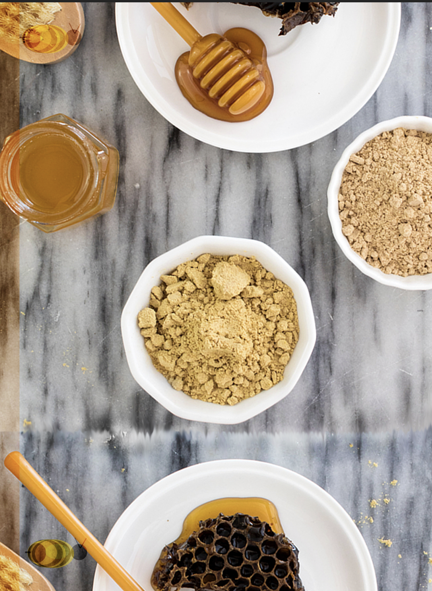
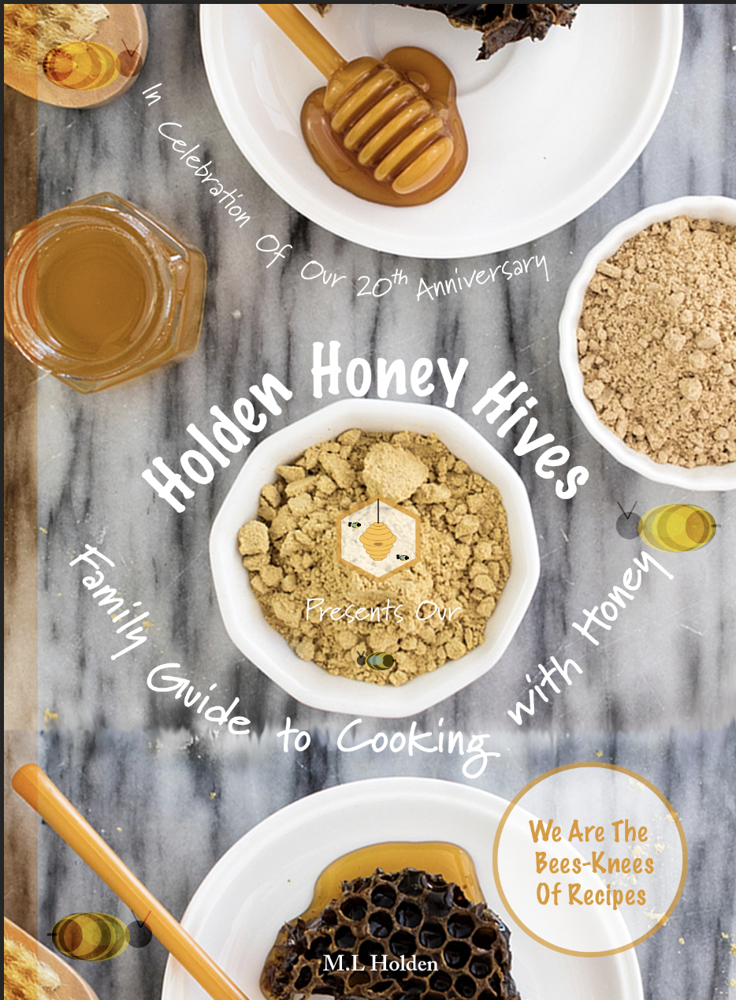
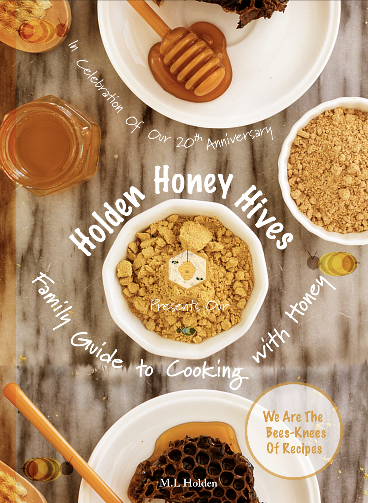

Welcome back to the **hive** ~ how have you **bee-n**?

Fun fact of the week: bees have four wings! 

From our previous posts, you should now all have a running theme and idea on what your product and/or service should revolve around.

Let's use **Holden Honey Hives** as our case study today to provide you with working example to review.

A cover has to be engaging, eye-catching, and most importantly, relevant.

It may take hours, days, months, potentially even years. Or it might take minutes, seconds. You might get it right first attempt, you may not. These things take time and shouldn't be rushed, unless the **Queen Bee** orders it. When it happens, you'll know. You'll think "that's the one".

Creating a cover involves miniscule changes using Adobe programmes such as Photoshop and Indesign, as shown in this working example.

Here is the blank cover:

Let's first look at the basic principles of a **reci-bee** cover, with a little help from the bees at **[Glad Works](https://www.gladworks.com/blog/principles-design-recipe-successful-layout)**:

### Balance

When things are visually balanced, the potential customer will begin to feel uncomforable at first glance. When the added additions of bee's the the blank canvas with the cover image, it not only adds context to what the recipe book is about, but also a family-friendly tone with how the bees were created. 

As, so far, every added detail is focused on the left-hand side. When we add another bee to the right-hand side, it helps pull focus to the centre of the page, where the title and headings will be.

### Rhythm

Rhythm, for design is about creating a pattern through repeating and changing elements. That is one of the reasons by the placement of the bees is so important, they help create a relaxing feel. When the logo of the company is added into the middle, it shows that this is where the focus should be.

### Emphasis

To make the important things stand out and get noticed by potential customers, our key selling point was our brand name ***Holden Honey Hives***, therefore it had to have centre stage. As our image had a bowl in the centre, we decided to introduce more of our personal style of fun, and make the text surround the circle. 

Next, our slogan is: 

> *We are the bees knees of recipes!*

This is shows that we belive in our product and so, to show its prominence, we placed it in its own personal sphere, that if it were a print recipe book, would have been a sticker. 

### Unity

Unity can be undertaken by repeating a certain colour scheme, texture, using similar type styles and so forth. We decided upon using light, honey-based tones with a modern twist to it. For our brand name and tag line, we used the font style *Marker Felt*, for the headline *In Celebration of Our 20th Anniversary* and for *Family Guide to Cooking with Honey*, we used the font style *Marydale.* 

After this, we added a semi-transparent-coloured-cover over the canvas to help unify the product and add a warm, honey tone to the overall look. 

Well our little darling bees, we hope that looking into our creative process was as helpful to you as it was to us. 

We look forward to catching up with you next week for: *A Website, should I or not?*

Until then our ever-buzzing hive, good day and good night.