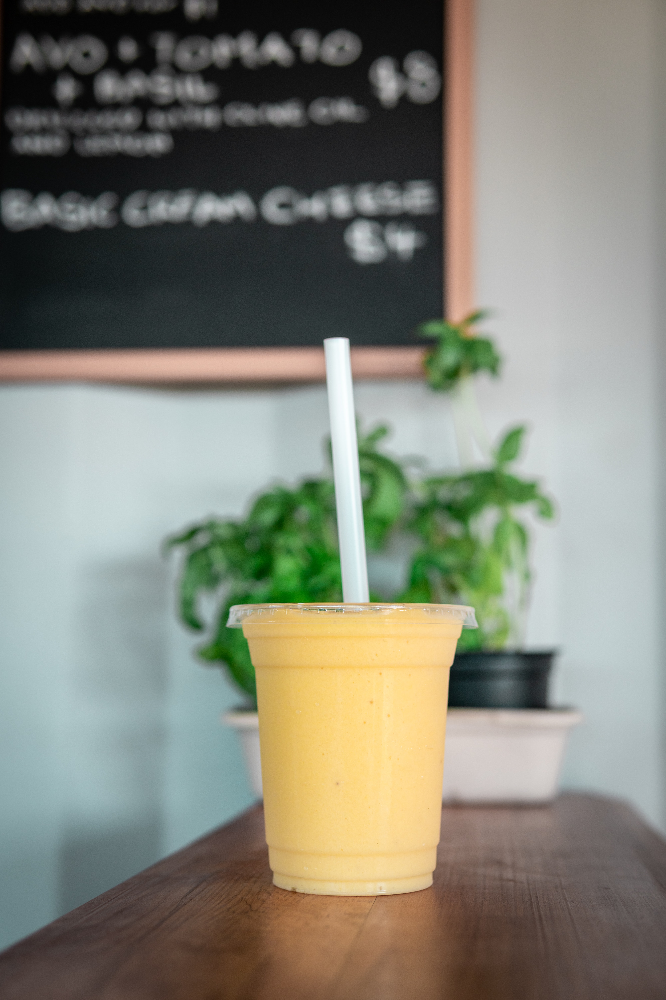

Here at **Holden’s Honey Hive**, we pride ourselves on ensuring that all the family gets a great start to the day with our award winning honey. Why not try bringing together the **brood** by spicing up the bland family breakfast with this quick and easy smoothie, filled to the brim with vitamins, proteins and fibre. It’ll be too good to resist. It’s perfect for on the go, because even the **busiest of bees** gotta eat. Better yet, it counts for one of your five-a-day!

## Ingredients

* 1 or 1/2 Mangos (pitted, peeled and diced)  
* 1 Banana 
* A handful of baby spinach
* 2 tablespoons of ground flax seeds
* 2 tablespoons of honey
* 1 cup of cold water or ice cubes

## Method

1. Chop up the banana and place into the **bee**-lender with the pitted, peeled and diced up mango.
2. Add in a handful of spinach and the ground flax seeds, which are high in Omego and fibre, to keep the **hive** fuller for longer.
3. Pour the honey over the ingredients, then either add the water or ice to the mixture and **bee-**lend until smooth.
4. This is where the honorary food testers (aka:**worker bees**) come and check to see if any more honey is needed.
5. When the right concoction has been made, serve for all to enjoy it.

   *Can be kept in the fridge for a day.*

* Serves: 1
* Preparation time: 10 minutes
* Cooking time: 2 minutes

Attached below is YouTube video detailing how to create this delicous honey concocation, ours has an added twist to it with the flax seeds.

<iframe width="560" height="315" src="https://www.youtube.com/embed/https://youtu.be/2MJkyIFpOlA?rel=0" allow="accelerometer; autoplay; encrypted-media; gyroscope; picture-in-picture" allowfullscreen></iframe>
