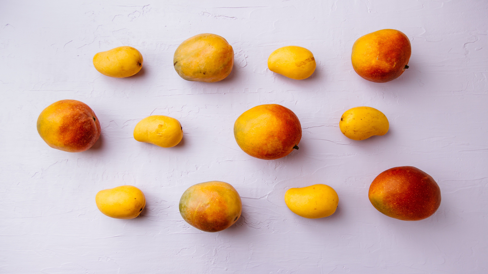

Here at **Holden’s Honey Hive**, we pride ourselves on ensuring that all the family gets a great start to the day with our award winning honey. Why not try bringing together the **brood** by spicing up the bland family breakfast with this quick and easy smoothie, filled to the brim with vitamins, proteins and fibre. It’ll be too good to resist. It’s perfect for on the go, because even the **busiest of bees** gotta eat.

## Ingredients

* 1 or 1/2 Mangos (pitted, peeled and diced)  
* 1 Banana 
* A handful of baby spinach
* 2 tablespoons of ground flax seeds
* 2 tablespoons of honey
* 1 cup of cold water or ice cubes

## Method

1. Chop up the banana and place into the blender with the pitted, peeled and diced up mango.
2. Add in a handful of spinach and the ground flax seeds, which are high in Omego and fibre, to keep you fuller for longer.
3. Pour the honey over the ingredients, then either add the water or ice to the mixture and blend until smoothie.

* Serves: 1
* Preparation time: 10 minutes
* Cooking time: 2 minutes