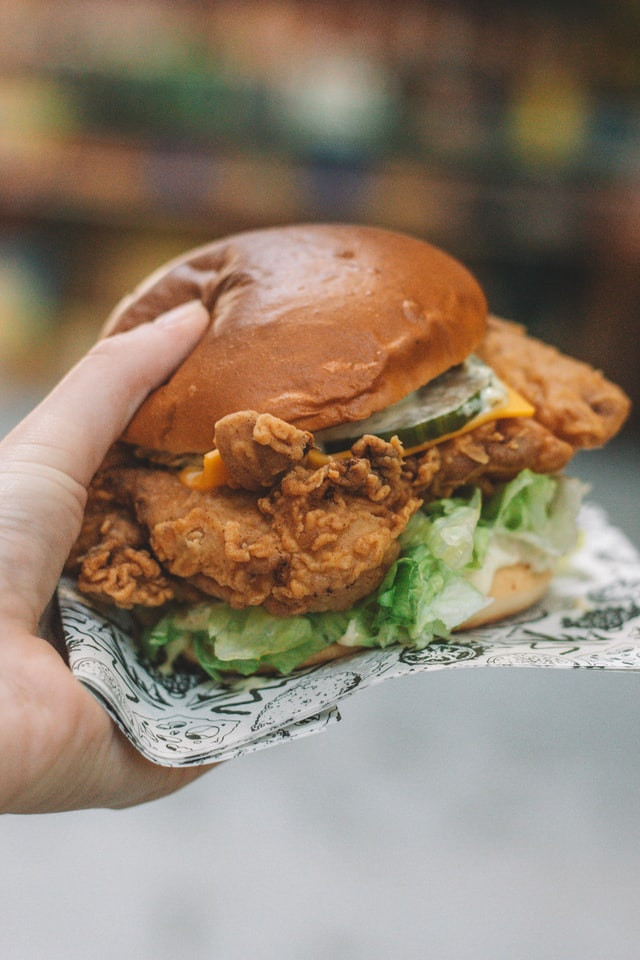

*We couldn’t make a recipe book to celebrate our anniversary without including our personal favourite: burgers. The sweetness of the honey scrumptiously contrasts the salty seasoning to create a mind-blowing experience that will leave the entire family feeling **buzzed** for the day ahead. There may even be a **waggle dance** involved.*

* Serves: 8
* Preparation Time: 45 minutes
* Cooking Time: 1 hour

## Ingredients:

* 1 + ½ cups of all purpose flour
* ½ cup of italian seasoned bread crumbs
* 1 + ½ teaspoons of garlic powder
* 1 teaspoon of onion powder
* 1 teaspoon of chili powder
* 1 tablespoons of italian seasoning
* 1 teaspoon of paprika powder
* 2 teaspoon of salt
* 1 teaspoon of pepper
* 1 egg
* ½ cup of milk
* ½ teaspoon of garlic powder
* 2 tablespoon of fresh lemon juice
* 2 tablespoon of honey, plus some for drizzling over the top at the end
* 1 broiler/fryer chicken (3-4 ib), cut up into pieces, let the meat sit at room temperature for 30 minutes
* Oil for frying

### Extras:

* 8 bread buns
* 2 handfuls of spinach or lettuce
* 8 slices of cheese
* 16 small gherkins
* 1 ½ tomatoes, sliced thinly

## Method:

1. Preheat the oven to 375F
2. Line a baking tray with parchment paper
3. In a small bowl, mix the first nine ingredients
4. In a separate small, shallow bowl, whisk together the egg, milk, garlic powder, lemon juice and honey until well blended.
5. Dip the chicken in the flour mixture to coat all sides and then shake off excess.
6. Next, dip the chicken in the egg mixture, then again in the flour mixture. Set the chicken aside on the plate to rest for 10 mins
7. Pour the oil into the cast iron skillet over medium high heat.
8. Heat the oil to 375F. Fry the chicken, a few pieces at a time (do not crowd), 3-5 minutes on each side or until golden brown.
9. Transfer the chicken using tongs onto the baking tray. Bake in the oven until the chicken is done.
10. Then place the cooked honey chicken into the bread buns, add the lettuce or spinach, gherkins, cheese and tomatoes on top, and serve with either sweet potato chips or a salad.