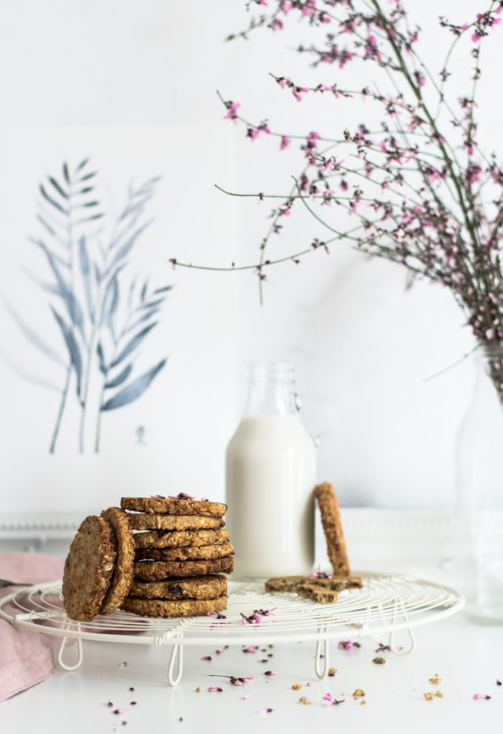

\
*Now, we know that you’ve got a **pollen** load of work that needs to be done, any and every family does. That’s why these Croatian Honey Spice Cookies are quick and easy, but most importantly, fun to make. Add in a glass of milk and you’ve got yourself a delcious treat to keep the **brood** entertained.*

*Want to spice things up furthur? Then add a dash of our honey to the milk and warm up for an extra treat.*

Serves: 35 cookies

Preparation Time: 25 minutes

Cooking Time: 20 minutes

## Ingredients

250g of butter

180g of demerara sugar

250g of honey

3 eggs

1 teaspoon of baking soda

2 teaspoon of ground cinnamon

½ teaspoon of ground cloves

½ teaspoon of ground nutmeg

½ teaspoon of powdered ginger

300g of all-purpose flour

100g of whole wheat flour

350g of soft flour

12 walnuts (whole walnut kernels, divided into quarters)

### Method:

1. Heat the butter, sugar and **Holden Honey Hives'** honey, stirring constantly, over a low heat until the sugar and butter have melted completely. 
2. Set aside to cool for 10 minutes and lightly whisk the eggs. 
3. Mix and combine baking soda, spices, all-purpose, whole wheat and soft flour, we do not recommend bringing in the **foundlings** as taste-testers just yet, but they can sure help out with the mixing.
4. Add the lightly beaten eggs, flour and spices to the melted honey, sugar and butter mixture. Mix and combine to obtain a smooth and soft dough.
5. Here comes the time-consuming part: cover the dough with foil and leave in a cool place for 1 - 3 days (trust us, they're worth the weight)
6. Then divide and roll the dough into long rolls 1.5 cm in diameter, cut them into smaller rolls. Shape each role into a walnut sized ball.
7. Place the dough balls a few centimeters apart from each other on a baking sheet lined with parchment paper. 
8. Insert, only halfway, a quarter of the walnut hernel at the top of each cookie. If someone in your **hive** is allergic to nuts, why not subsitute with marshmellows, we're sure that they'll understand.
9. Bake the cookies in the preheated oven at 190C for 10-12 mins. 
10. Cool and store in an airtight container.

Here is a link to the original recipe at *[CookEatShare.](https://cookeatshare.com/recipes/medenjaci-croatian-honey-spice-cookies-653286)*