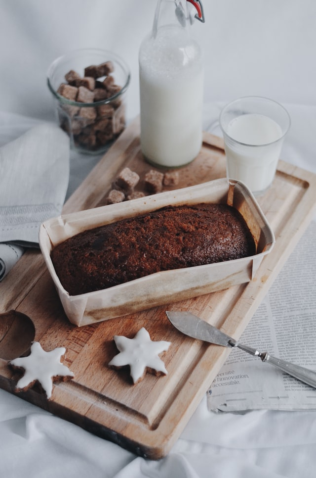

.

Serves: 4

Preparation Time: 25 minutes

Cooking Time: 40 minutes

## Ingredients

¼ cup of unsalted butter

1 & ½ cups of milk

2 large eggs

6 slices of white country bread

½ cup + 1 tablespoon of honey

5 tablespoons of hot water

¼ teaspoon of ground cinnamon

¼ teaspoon of vanilla

#### Method:

1. Preheat oven to 350F.
2. Butter 9-inch glass pie dish.
3. Lightly beat eggs, tare the slices of bread into 1 inch squares with the crust.
4. Whisk together the milk and eggs, then add the bread pieces and turn to coat them evenly. 
5. Leave the bread to soak for 15 to 20 minutes, turning over once or twice.
6. In a large, nonstick skillet, heat the remaining butter over medium heat. Then fry the soaked bread in butter until golden, about 2 to 3 minutes on each side and then transfer the bread to a baking dish.
7. In a bowl, combine the honey and hot water and stir until the mixture is evenly blended. 
8. Stir in the cinnamon and vanilla and drizzle the sauce over and around the bread.
9. Bake for 30 minutes or until golden brown.