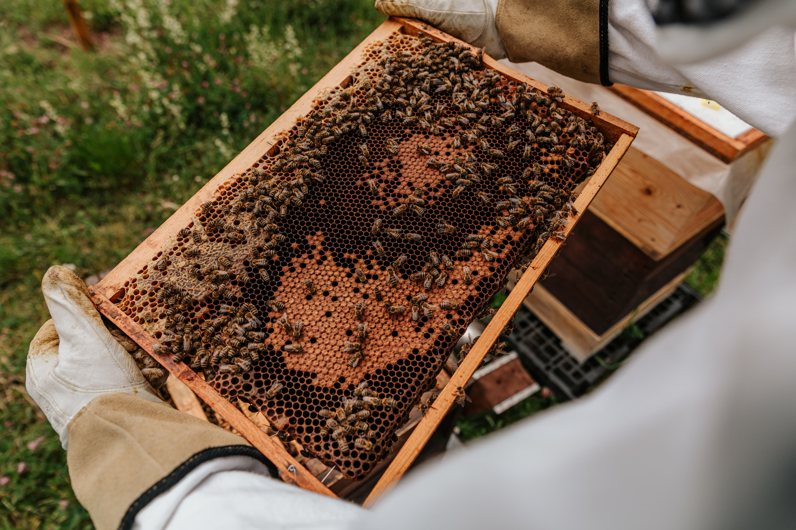

Hello to our **beehive** that showcases quality content based around one thing and one thing alone. Can you guess what that is? (Hint: it is the websites name).

Honey! That's right, honey doesn't have to **bee** for sweet treats, it can be for a whole number of things: chicken, cheese, eggs, and yes, even fish. 

As a family owned business, nay, lifestyle, honey runs through our veins. We breathe pollen as air. 

Like any other profession, there have been hardships, but we're not ones to **abscond** our passion of beekeeping. 

We thrive in the face of opposition and adversity, growing to **bee-come** the household brand you know and love today.

We created this website to inspire families and individuals to **cluster** together to become more aware of the necessity of bees to our eco-system. 

Don't be silent, let us **unite** and do a **waggle dance.**