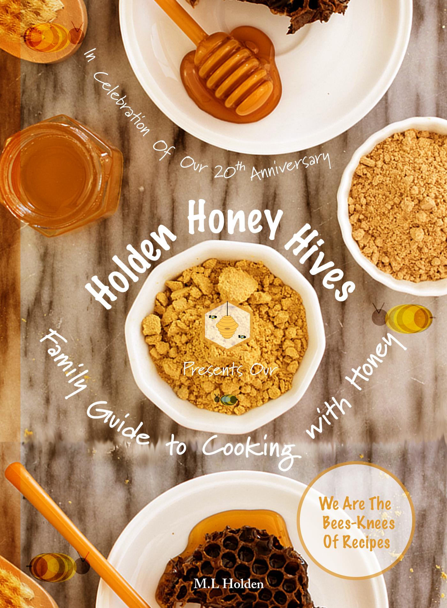

Welcome my darling bees to the epitome of honey based recipes.

**Bee-hind** the 20 years in the beekeeping **bee-ness**, we at **Holden’s Honey Hive** are happy to **bee-hold** our recipe book to celebrate the times **bumbling** along at the very beginning, to becoming a household brand. We have filled it to the brim with our most **buzzed-**about recipes incorporating our signature Honey for you, our **colony**.

From breakfast to supper, *Beeswax Smoothie* to *When Zesty and Sweet Met Salmon*, we have it all to enjoy some truly **un-bee-leviable** family moments. 

Don’t go **pollen** in love just yet, there's more...

10% of our profits’ will go to protecting our **flowering** bee community for a sweeter sunrise. 

This is the must-**hive** recipe book for your family-friendly fun if truth **bee** told, **honey**. Now, don’t **swarm outside**, it's available as an eBook.

> We're the **bees-knees** of reci**\-bees**, and we know it.

[See a list of all recipes](https://bloggg-website.netlify.app/allrecipes)